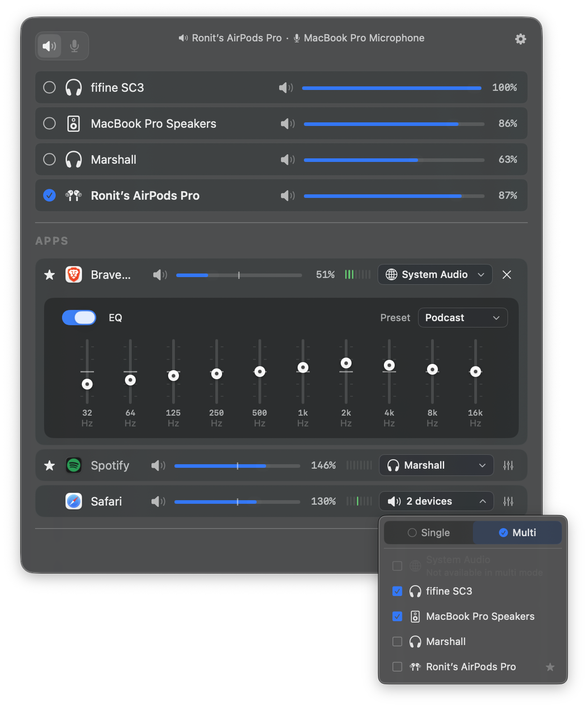
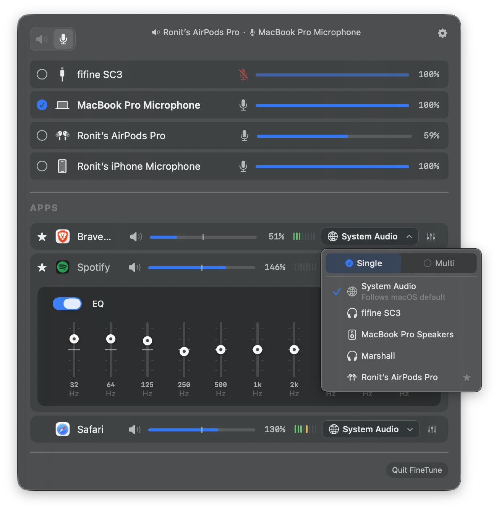
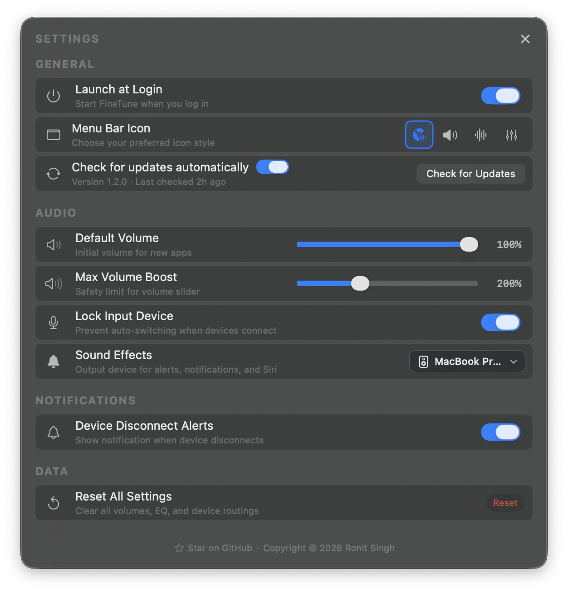
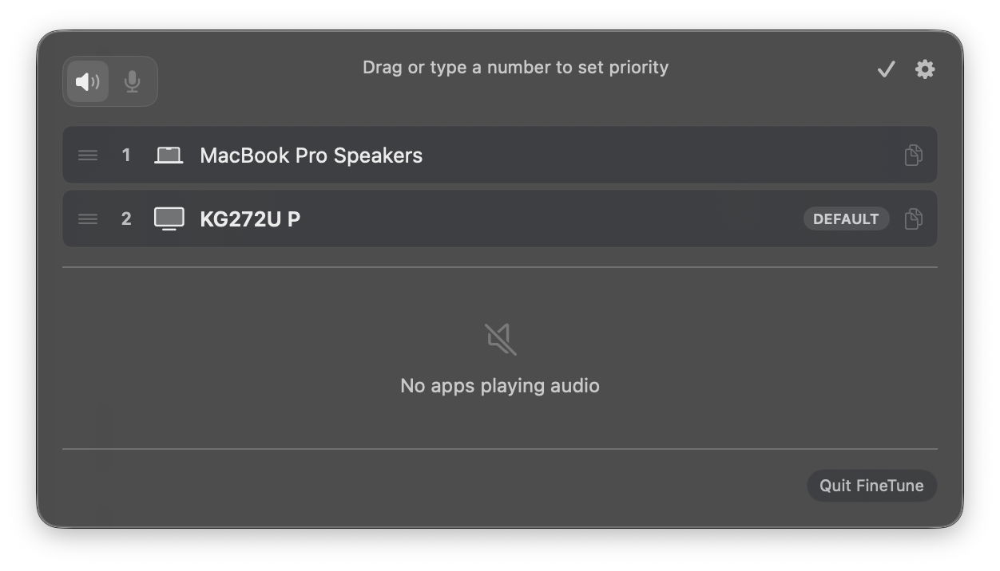

<p align="center">
  
</p>

<h1 align="center">FineTune</h1>

<p align="center">
  <strong>Per-app volume control for macOS</strong>
</p>

<p align="center">
  <a href="https://github.com/ronitsingh10/FineTune/releases/latest"></a>
  <a href="https://github.com/ronitsingh10/FineTune/releases"></a>
  <a href="LICENSE"></a>
  <a href="https://www.apple.com/macos/"></a>
</p>

<p align="center">
  The volume mixer macOS should have built in.<br>
  Free and open-source.
</p>

---

<p align="center">
  
</p>

## Features

- **Per-app volume** — Individual sliders and mute for each application
- **Multi-device output** — Route audio to multiple devices simultaneously
- **Input device control** — Monitor and adjust microphone levels
- **10-band EQ** — 20 presets across 5 categories
- **Pinned apps** — Pre-configure apps before they play
- **Audio routing** — Send apps to different outputs or follow system default
- **Monitor speaker control** — Adjust volume on external displays via DDC
- **Device priority** — Set preferred output order; auto-fallback on disconnect
- **Volume boost** — Amplify up to 400%
- **Menu bar app** — Lightweight, always accessible
- **URL schemes** — Automate volume, mute, device routing, and more from scripts

<p align="center">
  
  
</p>

## Install

**Homebrew** (recommended)

```bash
brew install --cask finetune
```

**Manual** — [Download latest release](https://github.com/ronitsingh10/FineTune/releases/latest)

## Why FineTune?

macOS has no built-in per-app volume control. Your music is too loud while a podcast is too quiet. FineTune fixes that:

- Turn down notifications without touching your music
- Play different apps on different speakers
- Boost quiet apps, tame loud ones
- Free forever, no subscriptions

## Requirements

- macOS 15.0 (Sequoia) or later
- Audio capture permission (prompted on first launch)

## FAQ

<details>
<summary><strong>App not appearing?</strong></summary>
Only apps actively playing audio show up. Start playback first.
</details>

<details>
<summary><strong>Volume slider not working?</strong></summary>
Some apps use helper processes. Try restarting the app.
</details>

<details>
<summary><strong>Input devices not showing?</strong></summary>
Grant microphone permission in System Settings → Privacy & Security → Microphone.
</details>

## URL Schemes

Control FineTune from Terminal, shell scripts, [Shortcuts](https://support.apple.com/guide/shortcuts-mac), [Raycast](https://raycast.com), or any app that can open URLs.

### Actions

| Action | Format | Description |
|--------|--------|-------------|
| Set volume | `finetune://set-volumes?app=BUNDLE_ID&volume=PERCENT` | Set volume (0–100, or up to 400 with boost) |
| Step volume | `finetune://step-volume?app=BUNDLE_ID&direction=up` | Nudge volume up or down by ~5% |
| Set mute | `finetune://set-mute?app=BUNDLE_ID&muted=true` | Mute or unmute an app |
| Toggle mute | `finetune://toggle-mute?app=BUNDLE_ID` | Toggle mute state |
| Set device | `finetune://set-device?app=BUNDLE_ID&device=DEVICE_UID` | Route an app to a specific output |
| Reset | `finetune://reset` | Reset all apps to 100% and unmuted |

### Examples

```bash
# Set Spotify to 50% volume
open "finetune://set-volumes?app=com.spotify.client&volume=50"

# Set different volumes for different apps at once
open "finetune://set-volumes?app=com.spotify.client&volume=80&app=com.hnc.Discord&volume=40"

# Mute multiple apps at once
open "finetune://set-mute?app=com.spotify.client&muted=true&app=com.apple.Music&muted=true"

# Step Discord volume down
open "finetune://step-volume?app=com.hnc.Discord&direction=down"

# Route an app to a specific device
open "finetune://set-device?app=com.spotify.client&device=YOUR_DEVICE_UID"

# Reset everything
open "finetune://reset"
```

<p align="center">
  
</p>

<details>
<summary><strong>Finding bundle IDs and device UIDs</strong></summary>

**Bundle IDs** — App names shown in FineTune map to bundle IDs. Common ones:
- Spotify: `com.spotify.client`
- Apple Music: `com.apple.Music`
- Chrome: `com.google.Chrome`
- Safari: `com.apple.Safari`
- Discord: `com.hnc.Discord`
- Slack: `com.tinyspeck.slackmacgap`

To find any app's bundle ID:
```bash
osascript -e 'id of app "App Name"'
```

**Device UIDs** — In FineTune, click the pencil icon to enter edit mode, then click the copy button next to a device name to copy its UID.
</details>

## Contributing

- ⭐ **Star this repo** — Help others discover FineTune
- 🐛 **Report bugs** — [Open an issue](https://github.com/ronitsingh10/FineTune/issues)
- 💻 **Contribute code** — See [CONTRIBUTING.md](CONTRIBUTING.md)

## Build from Source

```bash
git clone https://github.com/ronitsingh10/FineTune.git
cd FineTune
open FineTune.xcodeproj
```

## License

[GPL v3](LICENSE)
